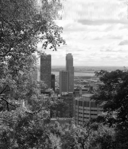
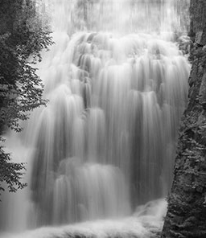
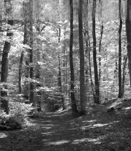
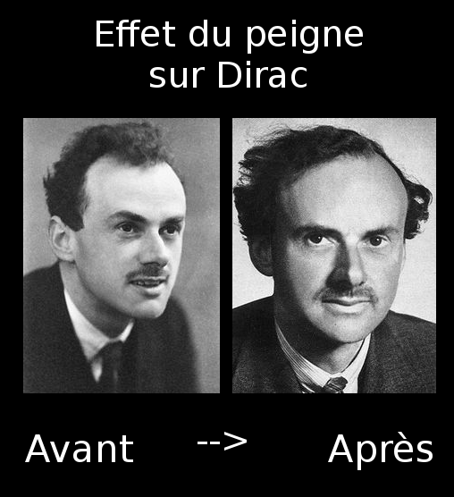

# TP 1 Traitement de signal

Remis par :

* Nicolas Hurtubise
* Guillaume Riou

## 2.2

Lors d'une convolution, le facteur de normalisation pour garder la moyenne de l'image est de 1/sum[coefficients de la matrice de convolution]

Puisque l'interpolation spectrale est équivalente à convoluer avec un noyau d'interpolation dans le domaine spatial, le facteur de normalisation serait simplement :

1/sum[coefficients du noyau d'interpolation]

## 2.3

Une façon simple serait d'appliquer la même technique que pour l'agrandissement spatial : on peut agrandir le support de l'image, y centrer l'image originale en zero-paddant autour, puis prendre la TF de cette nouvelle image.

## 3.3

Le seuillage dur permet de garder seulement les fréquences dominantes de l'image et d'ainsi arriver à une simplification de la texture recherchée. Une FFT inverse est par définition une interpolation optimale, ce qu'on utilisera pour remplacer les pixels dégradés par quelque chose de plus proche de l'image recherchée.

Commencer par utiliser la TF de l'image entière permet d'obtenir une texture grossière qui sera très peu influancée par la dégradation à éliminer. En répétant le processus en encerclant la dégradation et en diminuant la taille de la fenêtre de FFT utilisée, on peut avoir une approximation plus précise de la texture locale autour de la dégradation.

## 4

La base de la technique d'extrapolation est la même fonction `iteration` que pour notre interpolation.

La technique utilisée dans l'énoncé de travail semble utiliser une fenêtre rectangulaire de toute la largeur de l'image pour la TFD, ce qui a comme inconvénient de rendre la texture plus ou moins uniforme sur toute la zone extrapolée. Cela donne des résultats intéressants lorsque la texture est effectivement uniforme (ex.: Img1, Img2), mais pose des problèmes lorsque ce n'est pas le cas (ex.: le ParcMontRoyal ou la chute d'eau, où les arbres ont une texture plus fine que la ciel et l'eau).

Pour remédier à cette situation, nous avons plutôt utilisé plusieurs petites fenêtres qui se chevauchent. Les résultats présentés ont été effectués avec 10 itérations de l'algorithme d'interpolation par seuillage dur avec des fenêtres de largeur 8 pour chaque colonne de pixels.

Cette technique permet de mieux respecter les particularités des textures verticalement : les nuages extrapolés gardent une texture plus grossière par rapport à l'exemple donné.

Un inconvénient de la technique est la présence de discontinuités verticales dues aux fenêtres utilisées. Cet effet est relativement léger et ne parait pas lorsqu'on regarde l'image minimalement de loin.

Voici les résultats de la technique sur les différentes images proposées :

